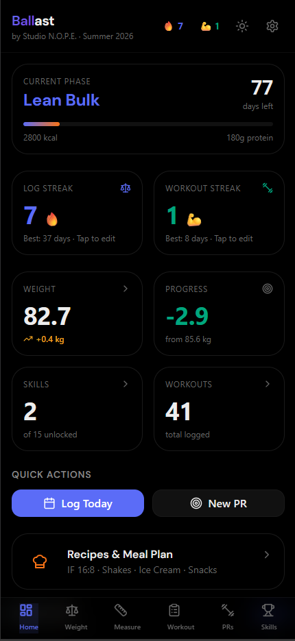
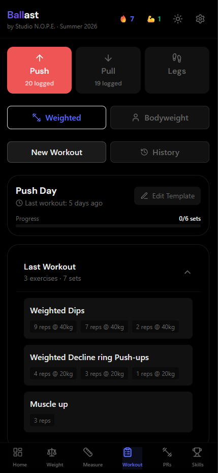
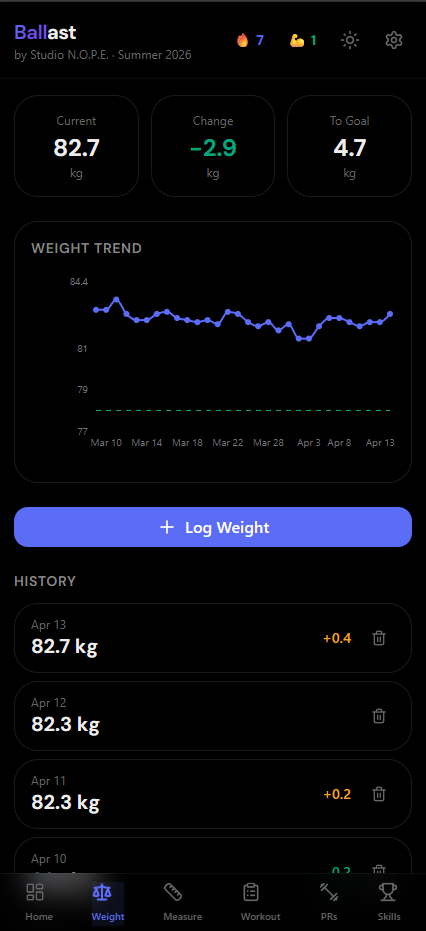
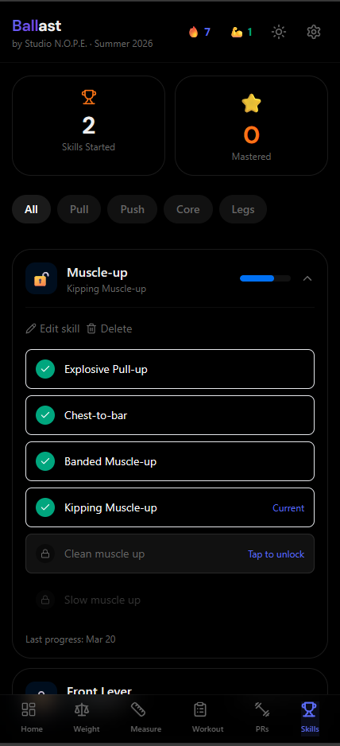
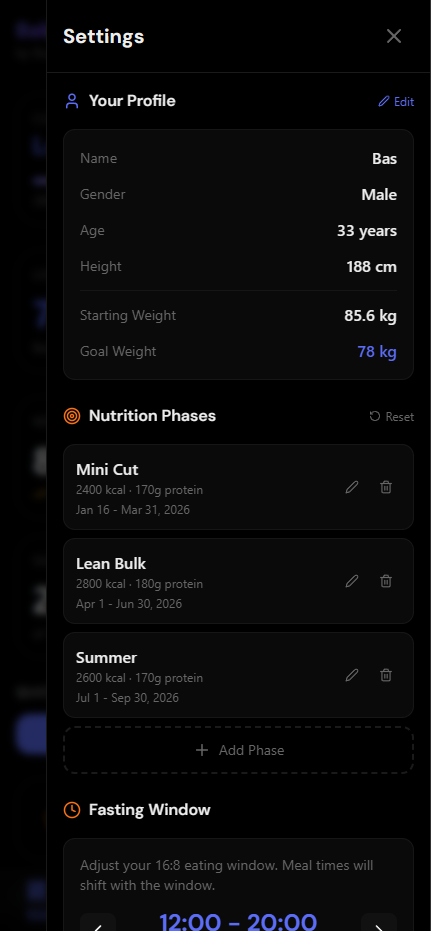

<p align="center">
  
</p>

# Ballast

**A free and open-source fitness tracker. Because nobody should pay €30/month for something this simple.**

A privacy-first, offline-capable Progressive Web App (PWA) for tracking weight, body measurements, strength PRs, and calisthenics skills. Your data stays on your device. No accounts. No cloud. No subscriptions.

**[Live demo →](https://ballast-sigma.vercel.app)**

---

## About Studio N.O.P.E.

Creative Solution Engineers using AI's infinite possibilities to help humans realise their dreams.

We're [@tijsluitse](https://github.com/tijsluitse) and [@basfijneman](https://github.com/basfijneman) — two guys who believe the best tools are the ones that get out of your way. We built Ballast because tracking your training shouldn't require a €30/month subscription and an account in somebody else's cloud. It should be one tap, some numbers, done — on a device you own, with data you own.

We made this open source because we think everybody deserves useful tools, not just the people who can afford them. When you can measure your progress without friction, you show up more often — and that's really what fitness tracking is for. Open source means the community can shape this into exactly what they need.

Want to work with us? We help teams build smarter workflows with AI-powered tooling, Shopify development, and creative engineering. Reach out at [info@studionope.nl](mailto:info@studionope.nl) or visit [studionope.nl](https://studionope.nl).

---

## Why Ballast exists

The fitness-tracking app market is full of apps charging €30/month (or $30, take your pick) for features that amount to writing down a number and drawing a graph. You shouldn't need a subscription to remember what you weighed last Tuesday.

Ballast started as a personal tool. It works. It's fast. It runs on your phone like a native app. It has no ads, no analytics, no dark patterns, and no upsells — because there's nothing to upsell. Fork it, self-host it, or just clone it and run it locally.

## Screenshots

<p align="center">
  
  
  
</p>
<p align="center">
  
  
</p>

## Features

- **Weight tracking** with trend graphs
- **Body measurements** — waist, chest, arms, legs, shoulders
- **Strength PRs** — log bodyweight and weighted exercise records
- **Calisthenics skills** — 15 skills pre-configured with progression steps (muscle-up, front lever, planche, handstand, etc.), fully editable
- **Workout logger** — PPL templates (push / pull / legs), both weighted and bodyweight variants
- **Recipes** — protein shakes, ice cream, waffles, snacks, all editable
- **Streak counter** to keep you honest
- **Dark & light mode** — toggle in the header; respects your system preference on first visit
- **PWA** — install on iOS or Android, works offline

## Data & privacy

Everything lives in your browser's `localStorage`. There is no backend. There is no telemetry. There is no account. If you clear your browser data, your data is gone — that's the trade-off for not having anyone else hold it.

## Quick start

```bash
git clone https://github.com/N-O-P-E/Ballast.git
cd Ballast
npm install
npm run dev
```

Open [http://localhost:5173](http://localhost:5173).

### Build for production

```bash
npm run build
```

Outputs a static site to `dist/`.

## Deploy it yourself

Ballast is a static PWA — drop `dist/` on any host.

- **Vercel / Netlify / Cloudflare Pages** — connect the repo, click deploy, done
- **GitHub Pages** — `npm i -D gh-pages`, add `"deploy": "gh-pages -d dist"` to scripts, `npm run deploy`
- **Any static host** — just serve the `dist/` folder

## Install as an app

### iOS
Open the deployed URL in Safari → Share → Add to Home Screen.

### Android
Open the deployed URL in Chrome → three-dot menu → Install app.

## Customize it

All defaults live in `src/constants/index.ts`:

- **Profile defaults** — `INITIAL_PROFILE`
- **Phase planner** — `DEFAULT_PHASES` (mini cut / lean bulk / maintenance blocks with calorie + protein targets)
- **Exercise list** — `EXERCISES`
- **Skills list** — `DEFAULT_SKILL_DEFINITIONS`
- **Workout templates** — `DEFAULT_TEMPLATES`
- **Recipes** — `DEFAULT_RECIPES`

Everything is also editable at runtime from the settings drawer.

## Tech stack

- React 18 + TypeScript
- Tailwind CSS
- Recharts (graphs)
- Lucide React (icons)
- Vite (build)
- `vite-plugin-pwa` (PWA / service worker)
- Studio N.O.P.E. design system (included in `src/design-system/`)

## Contributing

Issues and PRs welcome. Ballast is maintained as a gift to the internet — keep it kind and keep it focused. No analytics, no paywalls, no cloud sync that locks users in.

## License

MIT. Fork it, sell it, give it away, embed it in something weird. Just don't charge people €30/month for it.

## Follow us on X

If you want to see what Studio N.O.P.E. ships next, follow us on X:

- [@bas_fijneman](https://x.com/bas_fijneman)
- [@TisInternet](https://x.com/TisInternet)

## Star History

<a href="https://www.star-history.com/?repos=N-O-P-E%2FBallast&type=date&legend=top-left">
 <picture>
   <source media="(prefers-color-scheme: dark)" srcset="https://api.star-history.com/chart?repos=N-O-P-E/Ballast&type=date&theme=dark&legend=top-left" />
   <source media="(prefers-color-scheme: light)" srcset="https://api.star-history.com/chart?repos=N-O-P-E/Ballast&type=date&legend=top-left" />
   
 </picture>
</a>

---

Made with stubborn irritation by [Studio N.O.P.E.](https://studionope.nl)
